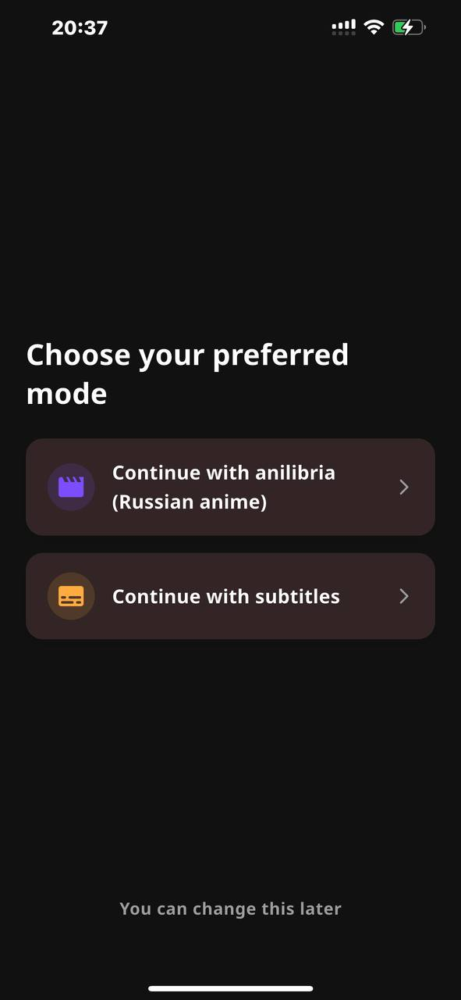
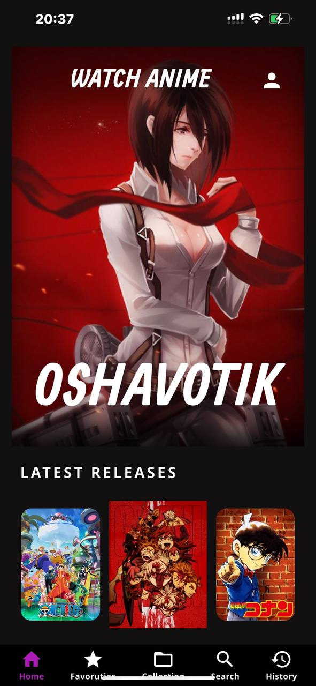
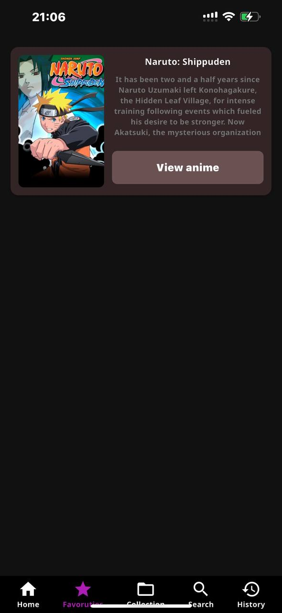
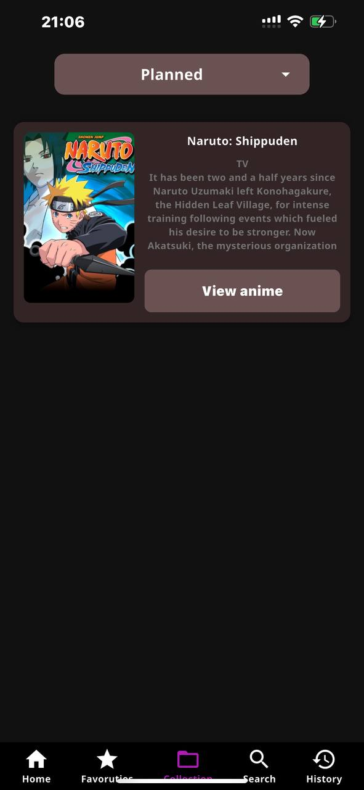

# Anime App

An anime viewing app built with Flutter. It allows users to discover new anime, track their viewing, and get information about series.

## Peculiarities
- Browse popular and new anime
- Search by title
- Detailed information about each anime
- Track episodes watched
- Localization (multiple language support)
- Watch anime with customizable subtitles — choose your preferred language and instantly translate them into any other language

##  Screenshots

<table>
  <tr>
    <td align="center">Mode selection</td>
    <td align="center">Main screen</td>
    <td align="center">Anime info</td>
  </tr>
  <tr>
    <td></td>
    <td></td>
    <td></td>
  </tr>
  <tr>
    <td></td>
    <td></td>
    <td></td>
  </tr>
</table>

##  Technologies
- **Flutter**
- **State**: Provider
- **Localization**: intl
- **Networking**: Dio
- **Caching**: SharedPreferences
- **API**:
  - [Anime API](https://github.com/astanx/anime_api)

##  Download

### Android
Download the latest release [here](https://github.com/astanx/anime_app/releases) or build the application yourself.

### iOS
1. Build the app yourself
2. Install the .ipa file via [AltStore](https://altstore.io)

