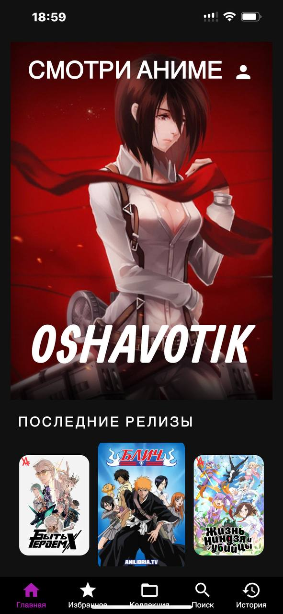
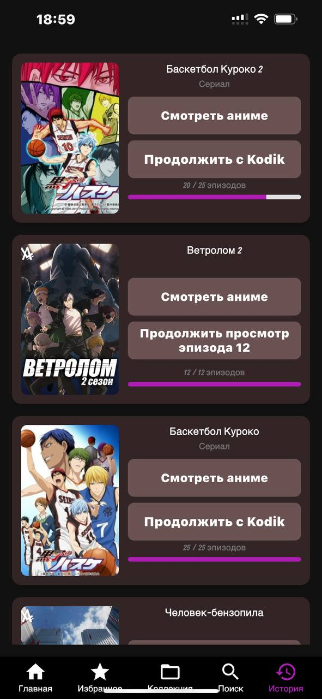
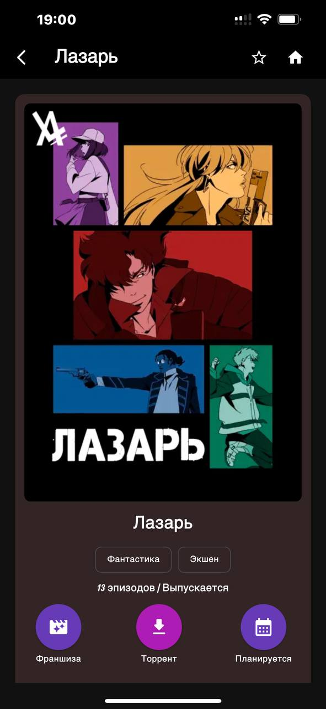
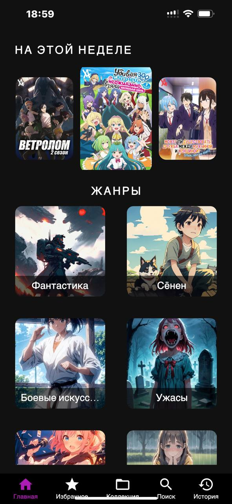
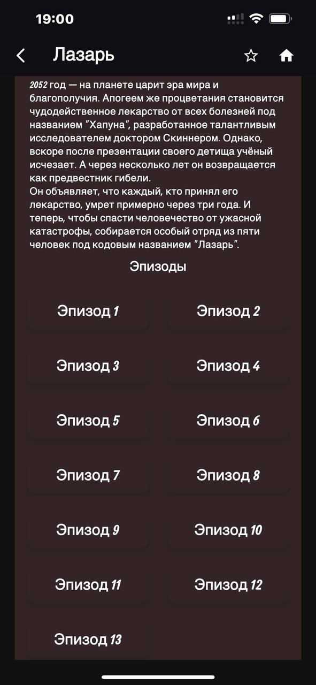

# Anime App

Приложение для просмотра аниме, созданное с использованием Flutter. Позволяет пользователям открывать для себя новые аниме, отслеживать просмотренное и получать информацию о сериалах.

## ✨ Особенности
- Просмотр популярных и новых аниме
- Поиск по названиям и жанрам
- Детальная информация о каждом аниме
- Отслеживание просмотренных серий
- Локализация (поддержка нескольких языков)
- Смотрите аниме с настраиваемыми субтитрами — выбирайте нужный язык и мгновенно переводите их на любой другой язык.

## 📸 Скриншоты

<table>
  <tr>
    <td align="center">Главный экран</td>
    <td align="center">История</td>
    <td align="center">Детали аниме</td>
  </tr>
  <tr>
    <td></td>
    <td></td>
    <td></td>
  </tr>
  <tr>
    <td></td>
    <td></td>
    <td></td>
  </tr>
</table>

## 🚀 Технологии
- **Flutter**
- **Состояние**: Provider
- **Локализация**: intl
- **Сетевое взаимодействие**: Dio
- **Кэширование**: SharedPreferences
- **API**: 
  - [Anime API](https://github.com/astanx/anime_api)

## 🛠 Установка

### Android
Скачайте последний релиз [здесь](https://github.com/astanx/anime_app/releases) или соберите приложение самостоятельно.

### iOS
1. Соберите приложение самостоятельно
2. Установите .ipa файл через [AltStore](https://altstore.io)

